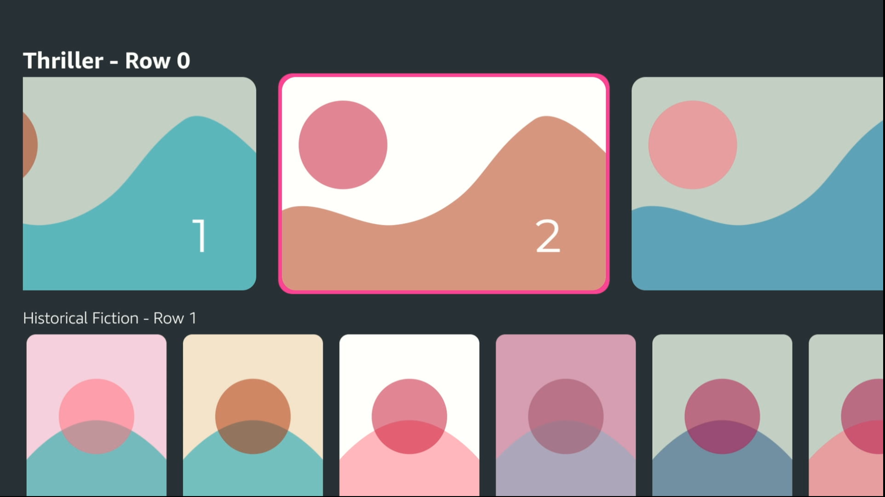
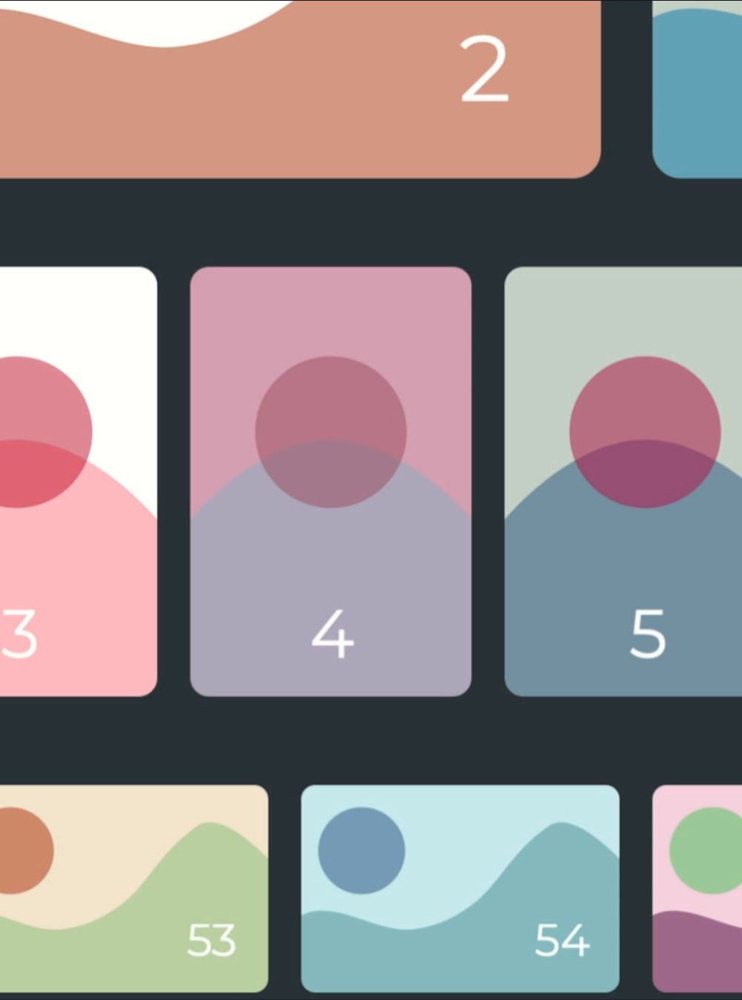
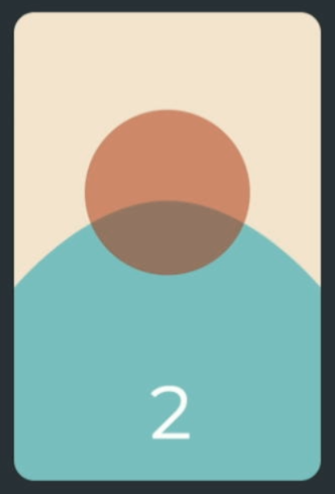
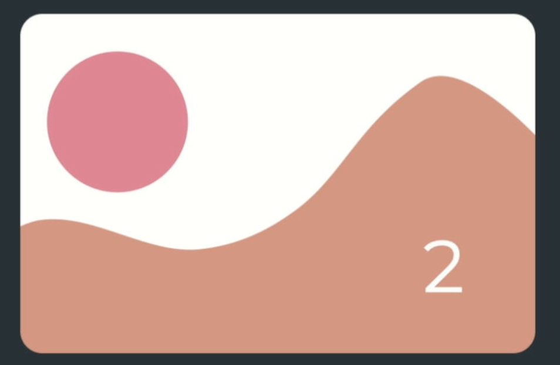
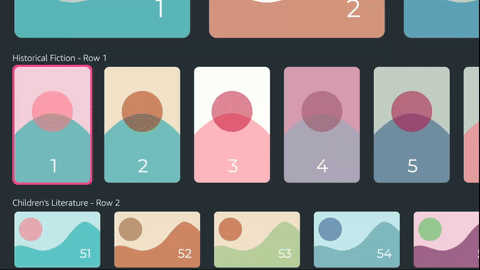
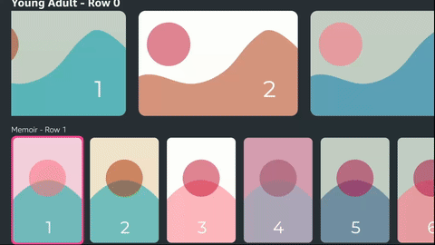

Vega Scrolling Sample App
=========================

The Vega Scrolling Sample App demonstrates how to build a home page grid layout using Vega components.




Introduction
------------

 The Vega Scrolling Sample App is optimized using the best practices for each component such as memoizing and avoiding state updates. The app is also configurable, allowing you to easily modify the elements while maintaining the optimizations. You can choose between two list components from Vega: `FlashList` and `Carousel`. These components were selected because they are the most performant lists. To learn more about list components, see the [List components](#lists-components) section and [Demo videos](#demo-videos).


Build and run the app
--------------------

### Prerequisites

Before you launch the sample app, make sure that you have [installed the Vega SDK](https://developer.amazon.com/docs/vega/0.21/install-vega-sdk.html).


### Step 1: Build the app

After you download the source code from GitHub, you can build the Vega Scrolling Sample App from the command line to generate VPKG files. The VPKG files run on the Vega Virtual Device and Vega Fire TV Stick.

You can also use [Vega Studio](https://developer.amazon.com/docs/vega/0.21/setup-extension.html) with Visual Studio Code to build the app.

1. At the command prompt, navigate to the Vega Scrolling Sample App source code directory. 

2. To install the app dependencies, run the following command. 

   ```
   npm install
   ```

3. To build the app to generate .vpkg files, run the following command.

   ```
   npm run build:app
   ```

4. At the command prompt, in the **build** folder, verify that you generated the VPKG files for your device's architecture.

   * **armv7-release/keplerscrollingapp_armv7.vpkg**&mdash;generated on x86_64 and Mac-M series devices to run on the Vega Fire TV Stick.
   * **x86_64-release/keplerscrollingapp_x86_64.vpkg**&mdash;generated on x86_64 device to run on the KVD.
   * **aarch64-release/keplerscrollingapp_aarch64.vpkg**&mdash;generated on Mac M-series device to run on the KVD.
   
### Step 2: Run the app

#### Vega Virtual Device

1. To start the Vega Virtual Device, at the command prompt, run the following command.

   ```
   kepler virtual-device start
   ```

2. Go to the directory where you placed the VPKG files. 

3. To install and launch the app on the Vega Virtual Device, run the following command, depending on your device architecture.

   - On Mac M-series based devices. 
      
      ```
      kepler run-kepler build/aarch64-release/keplerscrollingapp_aarch64.vpkg
      ```

   - On x86_64 based devices.
      
     ```
     kepler run-kepler build/x86_64-release/keplerscrollingapp_x86_64.vpkg
     ```  

#### Fire TV Stick

1. Turn on your Fire TV Stick.

2. To install and launch the app on your Fire TV Stick, run the following command.

   ```
   kepler run-kepler build/armv7-release/keplerscrollingapp_armv7.vpkg
   ```
Demo videos
--------------


### Carousel demo

<video src="docs/images/CarouselDemo.mp4" controls preload></video>

https://github.com/user-attachments/assets/049caff7-aa1f-4377-b0b6-e8def528674e


### FlashList demo

<video src="docs/images/FlashlistDemo.mp4" controls preload></video>

https://github.com/user-attachments/assets/f0ec2826-8811-419c-9124-565578e580b3


Configure the App
-----------------

The **config.ts** file allows you to customize the visual appearance and behavior of the Scrolling App. These configuration values are also used in the optimization features of the `FlashList` and `Carousel` components. When you make configuration changes, the lists are optimized for the new layout. It is recommended that you first make changes in the **config.ts** file before making changes in other files.

### Card configuration (CARD_CONFIG)

Card configuration controls the appearance of three different card types: `HERO`, `VERTICAL`, and `REGULAR`. For more information about the card types, see [Card variations](#card-variations).

For each card type, you can configure the following:

#### Title settings

* `HEIGHT`: Vertical space for the title.
* `FONT_SIZE`: Text size of the title.
* `FONT_WEIGHT`: Boldness of the title (for example, `300` and `700`).

#### Card settings

* `HEIGHT`: Card height.
* `WIDTH`: Card width.
* `BORDER_RADIUS`: Corner rounding of the card.
* `RESOLUTION`: Image resolution (`720`, `400`, `260`).
* `GAP`: Horizontal spacing between cards.
* `ROW_GAP`: Vertical spacing between rows.


### Row configuration (ROW_CONFIG)

Controls the layout of card rows. For each card type, you can set the following:

- `ITEM_COUNT`: Number of items to display.
- `HEIGHT`: Total row height (automatically calculated).
- `WIDTH`: Total width of row item (automatically calculated).

### Toggle list type

This app showcases two types of lists:`FlashList` and `Carousel`. Lists can be switched by setting the `currentList` variable. `FlashList` is the "default" list for the Scrolling app and used out-of-the-box. And most references in the documentation refer to the `FlashList` implementation. Some typescript errors might occur when using `Carousel`, but those errors can be ignored.

```tsx
export const currentList: ListType = Carousel // By default set to 'FlashList';
```

For more information, see [List components](#lists-components).


Grid layout
-----------

The Scrolling app implements a grid layout populated with rounded [`Card`](#card-component) components, designed to simulate a typical movie or TV content browsing interface. This layout follows a common design pattern known as a [horizontal stack layout](https://developer.android.com/design/ui/tv/guides/styles/layouts#horizontal-stack-layout), widely used in TV and streaming applications.


### Nested list structure

The grid is implemented using nested list components. Each row has [`Card`](#card-component) components stored in a horizontally scrollable list (`CardRow`). Then these horizontal lists are arranged in a vertical list to enable vertical scrolling (`Grid`). The [**FlashlistGrid.tsx**](src/components/Flashlist/FlashlistGrid/FlashlistGrid.tsx) file includes the implementation of the vertical list.

* **Horizontal list** (`CardRow`)

  * Each row contains a horizontal list of cards.
  * Represents a single category or content type.
  * Allows horizontal scrolling within each row.

* **Vertical list** (`Grid`)

  * Combines multiple horizontal rows vertically.
  * Enables overall grid navigation and scrolling.


### Heterogenous list

#### Challenges

The rows of the grid have different sized cards. This creates a non-uniform, or heterogenous list structure for the vertical list. The `FlashList` and `Carousel` components rely on predictable and uniform item sizes to optimize performance. Uniform item sizes allows these lists to pre-calculate the position and layout of items. However, with heterogeneous items, each row potentially presents a different height and layout. This forces the rendering engine to perform complex, computationally expensive calculations for every scroll and item placement.





#### Solution

To mitigate the challenge, you can instruct the lists about the different item and their dimensions. If the vertical list knows all the possible types of rows and their dimensions, then it is able to perform those pre-calculations. Also, the lists create separate recycling pools for each item type to avoid additional layout calculations. This solution can be implemented by using the `getItemType` and `overrideItemLayout` props for `FlashList` and the `itemDimensions` and `getItemForIndex` for `Carousel`. These props allow us to explicitly define the different types of rows and the dimensions for each one. For `Carousel`, each row must have a different component. The Scrolling app includes the base implementation of the [`CardRow`](src/components/Carousel/CarouselCardRow/CarouselCardRow.tsx), and then created variations of that component for the different card types [`CardRowVariations`](src/components/CardRowVariations/CardRowVariations.tsx).


 **Note**: Even with this solution, lists with uniform items perform better than heterogenous lists. Among other reasons, maintaining different recycling pools of the different item types consume more memory.

Card component
--------------

`Card` is the fundamental component of this app. It populates the `Grid` and comprises the bulk of the rendering. The Scrolling app renders >3000 `Card` components on startup. See the following details about `Card`.

- [A simple component structure](#a-simple-component-structure)
- [Eliminating state updates](#eliminating-state-updates)
- [Appropriate image resolutions](#appropriate-image-resolutions)

### A simple component structure

The `Card` component is comprised of very few elements. `Card` is an image with a border focus effect and is easily recycled and rendered.

### Eliminating state updates

State updates causes re-renders. Because there are many `Card` components on-screen, any re-render is costly. State updates do not work well with `FlashList` and `Carousel`. See the [Flashlist recommendations for state updates](https://shopify.github.io/flash-list/docs/recycling/).

### Appropriate image resolutions

Image selection is critical for optimizing visual quality and performance. Image resolution should precisely match the container size. Larger resolutions are scaled down to match the container. The extra resolution wastes memory and causes network delay. You must pick the minimum resolution for images to be clear and crisp to optimize your app for the typical TV viewing distance of 10 feet.


### Card variations

TV apps often have different types of cards to provide different emphasis to their content. These cards can vary in both shape and size. The following explains the details of the regular card, vertical card, and hero card. 


#### Regular card: the catalog workhorse

The Regular Card is the foundational element of the grid, designed as a compact and versatile component that enables broad catalog representation while maximizing information density. Its smaller size makes it ideal for displaying extensive content collections, providing quick, at-a-glance information that remains readable even when numerous items are presented simultaneously.

* **height:** 175 px
* **width:** 300 px
* **Items per row:** 40


### Vertical card: visual diversity

The Vertical Card introduces a distinctive elongated profile that breaks visual monotony and offers a unique browsing experience. Its elongated design provides visual contrast and supports alternative content presentation, allowing interfaces to create rhythm and visual interest within the grid. This card type is particularly effective for highlighting vertically-oriented content and accommodating different media types that don't fit traditional horizontal layouts.

* **height:** 400 px
* **width:** 250 px
* **Items per row:** 80




### Hero card: emphasizing priority content

The Hero Card serves as a visual anchor, drawing immediate user attention to key content through its significantly larger dimensions. Positioned strategically, typically at the top of a page or section, this card type creates a strong visual hierarchy that guides users to the most important or featured content. Its substantial size introduces more complex focus interactions, challenging traditional navigation patterns and providing a dynamic focal point in the interface.

- **height:** 400 px
- **width:** 700 px
- **Items per row:** 50



Lists components
----------------

Lists are a vital part of TV apps. Lists are used to display an content catalogue of an app similarly to the Scrolling app. Vega provides several options for creating lists of elements:

* `ScrollView`
* `FlatList`
* `FlashList`
* `Carousel`

The Scrolling app demonstrates `FlashList` and `Carousel` components. These were selected because they are the most performant lists. Their strength comes from recycling list items. By default, the Scrolling app uses `FlashList` to create its layout. `Carousel` can be toggled in the configuration (for more information, see [Toggle list type](#toggle-list-type)). The Scrolling app uses nested lists with a horizontal list for each row (`CardRow`) and a vertical list (`Grid`) to create a grid.

### Key Performance Indicators (KPI) for list components

Performance test scripts can be found in the `test/performance` folder. The `generalTest.py` script tests the entire app layout. This is the test that was used to obtain the performance numbers in the following table for the `FlashList` and `Carousel` components. To run and set up performance testing, see [Measure Your App KPIs](https://developer.amazon.com/docs/vega/0.21/measure-app-kpis.html).

| List component | PO | P50 | P90 | P95 | P99 | P100 | stdev | variance |
| -------------- | -- | --- | --- | --- | --- | ---- | ----- | -------- |
| `FlashList`    | 99.7 | 99.45 | 97.98 | 97.68 | 97.68 | 97.68 | 0.74 | 0.55 |
| `Carousel`     | 99.8 | 99.38 | 98.88 | 98.63 | 98.63 | 98.63 | 0.3 | 0.09 |


### Separated components

Separate `Grid` and `CardRow` components were created for each list type and are stored in the **../src/components/FlashList** and **../src/components/Carousel** directories. Where possible, common code is shared in **src/utils/listUtils.tsx**. Most references in the documentation refer to the `FlashList` implementation of the components.

### FlashList

`FlashList` is a third party library built for React Native and adapted for the Vega platform. `FlashList` is a cross-platform scrolling component that uses recycling behavior to be more performant.

**The performance of `FlashList` depends on precise data being passed in through its props.** This is especially true in a nested list layout like in the Scrolling app. Whenever possible, values should be pre-calculated outside of the components. In the Scrolling app the `CARD_CONFIG` and `ROW_CONFIG`is used to store these calculated values (see `config.ts` in the [Configure the app](#configure-the-app) section). This avoids calculations during component renders.

#### Props used to optimize `FlashList` performance

The following includes the props leveraged in this app to optimize `FlashList` performance. See Shopify's [Flashlist](https://shopify.github.io/flash-list/docs/usage) documentation for more info.

##### estimatedItemSize

The `estimatedItemSize` prop is the size of the items in the list.

###### Horizontal list

The `estimatedItemSize` prop is the width of the `Card` and any margin or other spacing. `marginRight` is used in the `Card` components to add gaps between them.

###### Vertical list

The `estimatedItemSize` prop is more complicated for the vertical list because each row has a different height. (To learn more, see the [Heterogenous list](#heterogenous-list) section.) Instead of using this prop, vertical list leverages the [`overrideItemLayout`](#overrideitemlayout) prop to explicitly specify the size of each row. Because `estimatedItemSize` is a required prop, a placeholder value is used for it. This placeholder value is the average height of the rows. `overrideItemLayout` overrides the value of `estimatedItemSize` so the placeholder is never used.

##### overrideItemLayout

The `overrideItemLayout` prop is used to explicitly define the size of every row, is necessary for the vertical list, and overrides `estimatedItemSize`. Pre-calculated heights from `ROW_CONFIG` are used.

```tsx
const overrideItemLayout = useCallback(
  (
    layout: {
      span?: number;
      size?: number;
    },
    item: RowData,
  ) => {
    layout.size = ROW_CONFIG[item.cardType].HEIGHT;
  },
  [],
);
```

##### getItemType

The `getItemType` prop helps `FlashList` identify the different rows in the vertical list. `FlashList` uses this to create separate pools for recycling. For example, this prevents rows with `HERO` cards from being recycled using rows of `VERTICAL` cards.

```tsx
const getItemType = useCallback((item: RowData) => {
  return item.cardType;
}, []);
```

##### drawDistance

The `drawDistance` prop is used in the vertical list to increase the number of items that `FlashList` renders. Vertical recycling is slower than horizontal recycling. So when scrolling vertically, users are more likely see blank areas or see rows visibly being recycled. Specifying `drawDistance` helps provide a smoother user experience. However, this comes at a performance cost, so evaluate the value of this in your own app.

##### keyExtractor

The `keyExtractor` prop is used to create a unique ID for each list item. This is especially important to help the app properly distinguish between items when focusing.


##### ItemSeparatorComponent

It is recommended to not use the `ItemSeparatorComponent` prop. Implementing a gap using `margin` is slightly more performant.

### Carousel

`Carousel` was built natively for Vega which allows it perform intensive scrolling operations on the native threads. Carousel has the best performance out-of-the-box compared to the other scrolling solutions. However, because it is a native Vega component, it does not work on cross-platform React Native apps. See the Vega [Carousel docs](https://developer.amazon.com/docs/vega-api/0.21/carousel.html) for more details.

#### itemDimensions

Unlike `FlashList`, `Carousel` requires users to define the height and width of list items.

##### Horizontal list

Precomputed values from `CARD_CONFIG` are used.

##### Vertical list

The items of the vertical list are rows. The width of the rows, is the visible, scrollable part of the row. It is _not_ the combined total with of all the cards in the row. If the row fills the entire width, it matches the screen size. For example, a 1920p display would be 1920px. The scrolling app has spacing to the left of the grid. The width is calculated in the following example. 

```tsx
const CAROUSEL_ITEM_DIMENSIONS = [
  {
    view: CARD_ROW_VARIATIONS.HERO,
    dimension: {
      width: SCREEN_DIMENSION.width - PAGE_PADDING,
      height: ROW_CONFIG.HERO.HEIGHT,
    },
  },
  ...
];
```


 **Note**: All rows of a grid layout have the same width so the same value can be used.


#### getItemForIndex

`getItemForIndex` is used to inform the Carousel what each component is used to render each element. Wrapper components were created for each `CardType` (`CardViartions` and `CardRowVariations`) so that Carousel can better distinguish between the items. Each `CardType` has different dimensions so Carousel needs to know which item  appears where.


#### numOffsetItems, firstItemOffset, and initialStartIndex

These props are used in the horizontal lists to fix the focused item to the center when scrolling. For more information, see the [Customizing scrolling](#customize-scrolling) section.


Customize scrolling
-------------------

Two common types of scrolling behaviors are natural and fixed scrolling. The difference between two types is how the list scrolls relative to the focused element on the screen.

### Natural scrolling

Focus will freely move between all the elements in the current viewable window. When focus moves beyond the viewable window, the window will scroll to reveal the next focusable element.



### Fixed scrolling

Focus is fixed, or trapped to one position on the screen. Common positions are at the start, middle, or end of a list. When focus changes, the window scrolls to move the newly focused element to the same position.



### FlashList

#### Fixed scrolling

To implement fixed scrolling, the default scrolling in `FlashList` is disabled, and `scrollToIndex()` is programmatically called to manually scroll the list to the appropriate positions. Because the Scrolling app uses a nested list, horizontal and vertical scrolling must be triggered. You must create functions for scrolling horizontally and vertically, and then pass the functions into the `Card` component.

1. Disable scrolling.

   ```tsx
   export const FlashlistGrid = () => {
       ...
       return (
           <FlashList
           ref={verticalRef}
           scrollEnabled={false} // disables the natural scrolling
           ...
           />
       );
   }
   ```

2. Set up a ref for `FlashList`.

   ```tsx
   export const FlashlistGrid = () => {
      const verticalRef = useRef<FlashList<RowData>>(null);
      ...
      return (
         <FlashList
         ref={verticalRef}
         ...
         />
      );
   }
   ```

3. Create the scroll function.

   You use the ref to the `FlashList` to invoke the `scrollToIndex()` function. This function has two important parameters:

   * `index`: Determines which card is scrolled to.
   * `viewPosition`: Determines the fixed position of the focused element. The value is between `0` to `1.0` that represents a fraction of the viewable window. The following are some common values:
     * `0`: Focus is fixed to the start of the viewable window.
     * `0.5`: Focus is fixed to the middle of the viewable window.
     * `1.0`: Focus is fixed to the end of the viewable window.

   ```tsx
   export const FlashlistGrid = () => {
      const verticalRef = useRef<FlashList<RowData>>(null);
      const scrollVertically = (rowIndex: number) => {
         if (verticalRef.current) {
         verticalRef?.current?.scrollToIndex({
               animated: true,
               index: rowIndex,
               viewPosition: 0.5,
         });
         }
      };
      ...
   }
   ```

4. Pass the scroll function to child element.

   You need to trigger scroll when the focus is on the card. You must pass the `scrollVertically()` function to the `Card` component. Next, you create a `scrollHorizontally()` function in `CardRow` and pass it to `Card`.

   ```tsx
   export const FlashlistGrid = () => {
      const renderRow =  ({item}: {item: RowData; index: number}) => {
         const CardRow = CARD_ROW_VARIATIONS[item.cardType];
         // passing scroll function to CardRow which will eventually pass to Card
         return <CardRow rowData={item} scrollVertically={scrollVertically} />;
      }
      ...
   }
   ```

5. Trigger scroll when the focus is on the card. Next, in the card you trigger the scroll animation during focus.

   ```tsx
   export const Card = ({cardType, data, scroll}: CardProps) => {

   const focusHandler = () => {
      ...
      // scrolling both horizontally and vertically
      if (currentList === 'FlashList') {
         scroll.vertically?.(data.rowIndex);
         scroll.horizontally?.(data.index);
      }
   };
   return (
      <Pressable
         ref={isFirstCard ? firstCardRef : undefined}
         onFocus={focusHandler}
         ...
         >
      </Pressable>
   )
   };

   ```

#### Natural scrolling

Natural Scrolling is the default scrolling behavior in `FlashList`, `FlatList`, and `Scrollview`. 


**To enable scrolling and comment out the scrolling functions in Card**

```tsx
export const FlashlistGrid = () => {
    ...
    return (
        <FlashList
        scrollEnabled={true}
        ...
        />
    );
}


export const FlashlistCardRow = () => {
    ...
    return (
        <FlashList
        scrollEnabled={true}
        ...
        />
    );
}

export const Card = ({cardType, data, scroll}: CardProps) => {
  const focusHandler = () => {
    //   scroll.vertically?.(data.rowIndex);
    //   scroll.horizontally?.(data.index);

  };
  ...
};

```

### Carousel

#### Fixed scrolling

This is the default scrolling behavior of `Carousel`. 

**To fix the different areas of the scrollable window for horizontal scrolling in `CarouselCardRow`**

```tsx
const cardWidth = ROW_CONFIG[rowData.cardType].WIDTH;
const numItems = screenWidth / cardWidth;

initialStartIndex = Math.floor(numItems / 2);
firstItemOffset = (screenWidth - cardWidth) / 2;
numOffsetItems = Math.ceil(numItems - 1);
...

<Carousel
    initialStartIndex={initialStartIndex}
    firstItemOffset={firstItemOffset}
    numOffsetItems={numOffsetItems}
    ...
/>
```

#### Natural scrolling

Set the `focusIndicatorType` prop to `'natural'`.

## Focus effects

In television application design, the focus state is crucial for user navigation. The Scrolling app implements a focus effect through a bright border, or "focus ring", within the `Card` component. The distinctive visual indicator helps users track their current selection across the grid interface, transforming a static display into an interactive experience by providing clear and animated feedback about the active item.


### Using animation

The optimal method to apply a focus effect is using the React Native Animated API. For more information, see [React Native Animations](https://reactnative.dev/docs/animations).

#### Native animations

The main advantage of implementing the focus effect through the Animated API is leveraging native animations. The Animated API has an option called `useNativeDriver`. This sends the animation configuration to the native thread and performs the animation natively. This frees up the JS thread for other purposes.

However, there are limits to this approach. Only specific style properties like `opacity` and `transform` can be implemented using the `useNativeDriver`. For more information, see [React Native Animations](https://reactnative.dev/docs/animations#caveats).

#### No state updates required

Another advantage of this approach is that it requires no state updates and greatly decreases the number of re-renders.

#### Implementation

Because `borderWidth` can't be animated using the native driver, `opacity` is used. An `Animated.View` is placed behind the image in `Card`. The `Animated.View` is initially invisible (`opacity = 0`). But, on focus, the animation triggers to make it visible (`opacity = 1.0`).

```tsx
const animationValue = useAnimatedValue(0);

const focusHandler = useCallback(() => {
  Animated.timing(animationValue, {
    toValue: 1,
    duration: 100,
    useNativeDriver: true,
  }).start();
}, [data.index, data.rowIndex]);

<Pressable onFocus={focusHandler}>
  ...
  <Animated.View
    style={[
      {
        position: 'absolute',
        zIndex: -1,
        backgroundColor: '#de4788',
        opacity: animationValue,
      },
    ]}
  />
</Pressable>;
```

### Using InteractionManager

`InteractionManager` allows you to schedule animations. By using the `InteractionManager.runAfterInteractions()` command, you can delay an animations until all other animations and interactions are completed. This reduces the chance of overloading the JS thread and helps to improve overall responsiveness and fluidity of the Scrolling app. **However, this might not be appropriate for every app**. `runAfterInteractions()` postpones after all animations, including scroll animations. The focus effect might look like it's "lagging" because it is not triggered until after the scroll animation.

```tsx
const focusAnimation = useCallback(() => {
  Animated.timing(animationValue, {
    toValue: 1,
    duration: 100,
    useNativeDriver: true,
  }).start();
}, [data.index, data.rowIndex]);

const focusHandler = useCallback(() => {
  InteractionManager.runAfterInteractions(focusAnimation);
}, [data.index, data.rowIndex, focusAnimation]);
```

### Focusing on the first card

Typically TV apps start with focus on one of the items. This serves as the starting point for navigation and the user experience. In the scrolling app, the focus is automatically on the first `Card` and the first `CardRow`. This is done through the `FocusManager` API.

#### FocusManager

`FocusManager` uses a `ref` on an element to focus on it. You must get the `ref` specifically of the first `Card`. Because `Card`(../src/components/Card.tsx) is re-used throughout the grid, you use a boolean check to identify the first card, and then the `ref` can be conditionally applied. `FocusManager.focus()` is called in a `usEffect` to ensure that the first child is focused as soon as it is rendered.

```tsx
const firstCardRef = useRef<View>(null);
const isFirstCard = data.index === 0 && data.rowIndex === 0;

useEffect(() => {
  if (isFirstCard) {
    FocusManager.focus(findNodeHandle(firstCardRef?.current));
  }
}, [isFirstCard]);
...

return (
  <Pressable
    ref={isFirstCard ? firstCardRef : undefined}
    ...
)
```

#### Avoid using hasTVPreferredFocus

`hasTVPreferredFocus` is another method to automatically draw focus onto components. Some edge cases exist where this might not perform well. For example, in a multi-page app, focus is reset between the different pages. `hasTVPreferredFocus` might not recognize the page change and focus may linger on the previous page. `FocusManager` provides a more reliable and intentional method to focus items.

### Avoid conditional styles

The most intuitive method of applying a focus border is to have a focus style and toggle it on and off when focus is triggered.

```tsx
const [isFocused, setIsFocused] = useState(false);
const focusHandler = () => {
  setIsFocused(true);
};

const focusedStyle = { borderColor: "green"}
<Pressable
    onFocus={focusHandler}
    style={isFocused ? focusedStyle : undefined}
    ...
/>;
```

**This is not recommended.** This relies on state updates which cause re-renders and strains the JS thread.


API Pagination
--------------

API pagination is a performance optimization feature that loads content on-demand as users navigate through the app. Instead of loading all cards at once, the app initially loads a small subset and fetches additional cards when users approach the end of a row. This approach significantly improves app startup time and memory usage, especially important for TV apps with large content catalogs.

API Pagination is enabled by default in `featureConfig.ts`

### Overview

The pagination system integrates seamlessly with both `FlashList` and `Carousel` components, providing smooth user experiences while maintaining optimal performance. The system uses a threshold-based trigger mechanism that anticipates user needs by fetching new content before users reach the end of currently loaded items.

#### Key benefits

- **Faster app startup**: Initial load times are reduced by loading only essential content.
- **Memory efficiency**: Lower memory footprint by loading content incrementally.
- **Network optimization**: Reduces initial bandwidth usage and spreads network requests over time.
- **Smooth user experience**: Predictive loading ensures content is available when users need it.

### Architecture

The pagination system is built on Redux with the following key components.

#### State management

Each row maintains its own pagination state through the `PaginationState` interface.

Example: 

```typescript
interface PaginationState {
  isLoading: boolean;        // Current loading status
  hasMore: boolean;          // Whether more content is available
  error: string | null;      // Error message if request fails
  lastRequestedIndex: number; // Prevents duplicate requests
}
```

#### Redux actions

The system uses several Redux actions to manage pagination state.

- `setPaginationLoading`: Updates loading status for a specific row.
- `setPaginationError`: Handles error states and messages.
- `setLastRequestedIndex`: Tracks the last requested card index to prevent duplicates.
- `addRowData`: Adds newly fetched cards to the row data.

#### Thunk actions

Async operations are handled through Redux thunks in `src/thunks/paginationThunks.ts`.

Example:

```typescript
export const fetchMoreCards = (
  cardData: CardData,
  paginationBatchSize: number,
  rowIndex: number
): AppThunk => async (dispatch, getState, api) => {
  // Pagination logic implementation
};
```

### Configuration

#### Enabling pagination

Pagination is controlled through the feature configuration.

Example:

```typescript
// src/config/featureConfig.ts
export const FEATURES_CONFIG = {
  API_PAGINATION: true, // Set to false to disable pagination
};
```

#### Page size configuration

Each row type has its own pagination settings in `ROW_CONFIG`.

Example:

```typescript
// src/config/layout/rowConfig.ts
export const ROW_CONFIG: RowConfig = {
  HERO: {
    ITEM_COUNT: 50,      // Total items available
    API_PAGE_SIZE: 10,   // Items loaded per pagination request
    // ... other config
  },
  VERTICAL: {
    ITEM_COUNT: 80,
    API_PAGE_SIZE: 15,
    // ... other config
  },
  REGULAR: {
    ITEM_COUNT: 40,
    API_PAGE_SIZE: 15,
    // ... other config
  },
};
```

#### Initial load

The app initially loads `API_PAGE_SIZE` number of cards for each row. This provides immediate content while keeping initial load times fast.

### Implementation details

#### Trigger logic

Pagination uses a threshold-based approach to determine when to fetch more content.

Example:

```typescript
const shouldTrigger = cardData.index >= currentRowLength - paginationBatchSize + 1;
```

This means pagination triggers when a user focuses on a card that's within `paginationBatchSize` cards of the end of currently loaded content. This predictive approach ensures smooth user experiences.

#### Request deduplication

The system prevents duplicate requests through several mechanisms.

Example:

```typescript
const isAlreadyRequested = cardData.index <= pagination.lastRequestedIndex;
const isCurrentlyLoading = pagination.isLoading;
const hasNoMoreData = !pagination.hasMore;

if (!shouldTrigger || isAlreadyRequested || isCurrentlyLoading || hasNoMoreData) {
  return [];
}
```

#### Focus integration

Pagination is triggered through the card focus system. When a user focuses on a card, the `onFocusUpdate` callback checks if pagination should be triggered.

Example:

```typescript
const onFocusUpdate = useCallback((cardData: CardData) => {
  if (FEATURES_CONFIG.API_PAGINATION) {
    dispatch(
      fetchMoreCards(
        cardData,
        paginationBatchSize,
        rowIndex
      )
    );
  }
}, [dispatch, paginationBatchSize, rowIndex]);
```

### API integration

#### API object structure

The system uses dependency injection to provide API methods to thunks.

Example:

```typescript
// src/services/dataService.ts
export const api = {
  cardApi: {
    fetchCards: mockCardFetch,
  },
};
```

#### Mock implementation

The current implementation includes a mock API that simulates network delays.

Example:

```typescript
const mockCardFetch = async (
  rowIndex: number, 
  startIndex: number, 
  count: number
): Promise<CardData[]> => {
  // Simulate network delay
  await delay(1000);
  
  const rowData = ROW_DATA[rowIndex];
  if (!rowData) {
    return [];
  }
  
  // Return a slice of the cards
  return rowData.data.slice(startIndex, startIndex + count);
};
```

#### Integrating real APIs

To integrate with real APIs, replace the `mockCardFetch` function with your actual API implementation.

Example:

```typescript
const realCardFetch = async (
  rowIndex: number, 
  startIndex: number, 
  count: number
): Promise<CardData[]> => {
  const response = await fetch(`/api/cards/${rowIndex}?start=${startIndex}&count=${count}`);
  const data = await response.json();
  return data.cards;
};

export const api = {
  cardApi: {
    fetchCards: realCardFetch,
  },
};
```

### Error handling

The pagination system includes comprehensive error handling.

#### Network errors

When API requests fail, the system performs the following:
1. Logs the error for debugging.
2. Updates the pagination state with error information.
3. Stops the loading indicator.
4. Allows users to retry by navigating away and back.

Example:

```typescript
try {
  const newCards = await api.cardApi.fetchCards(/*...*/);
  // Handle success
} catch (error) {
  const errorMessage = error instanceof Error ? error.message : 'Unknown error';
  console.error(`[API PAGINATION] Failed to fetch more cards for row ${rowIndex}:`, error);
  dispatch(setPaginationError({ rowIndex, error: errorMessage }));
  return [];
}
```

#### State recovery

The system automatically clears error states when successful requests are made, ensuring users don't get stuck in error states.

### Performance considerations

#### Memory management

Pagination helps manage memory by the following:

- Loading only visible and near-visible content.
- Working with FlashList's recycling mechanism.
- Preventing memory bloat from loading entire catalogs.

#### Network optimization

The system optimizes network usage through the following: 

- Predictive loading based on user navigation patterns.
- Request deduplication to prevent unnecessary calls.
- Configurable batch sizes to balance performance and user experience.

#### FlashList integration

Pagination works seamlessly with FlashList's recycling.

- New cards are added to existing data arrays.
- FlashList automatically handles rendering updates.
- Recycling continues to work with dynamically loaded content.

### Debugging and troubleshooting

#### Console logging

The system includes comprehensive logging for debugging.

Example:

```typescript
console.log(`[API PAGINATION] Triggering pagination for row ${rowIndex}, card ${cardData.index}`);
console.log(`[API PAGINATION] Number of Cards Retrieved: ${newCardsLen}`);
console.log(`[API PAGINATION] Row ${rowIndex} updated and now has ${row.data.length} cards`);
```

#### Common issues

**Pagination not triggering:**

- Check that `FEATURES_CONFIG.API_PAGINATION` is `true`.
- Verify that `API_PAGE_SIZE` is configured correctly.
- Ensure focus events are working properly.

**Duplicate requests:**

- The system should prevent duplicates automatically.
- Check console logs for request deduplication messages.
- Verify `lastRequestedIndex` is being updated correctly.

**Performance issues:**

- Consider adjusting `API_PAGE_SIZE` values.
- Monitor network request frequency.
- Check for memory leaks in long-running sessions.

#### State inspection

You can inspect pagination state through Redux DevTools.

Example:

```typescript
// Current pagination state for row 0
state.rows[0].pagination
```

### Best practices

* **Configure appropriate page sizes**: Balance between too many small requests and too few large requests.
* **Monitor network conditions**: Consider implementing adaptive batch sizes based on connection quality.
* **Monitor performance**: Track metrics to ensure pagination improves rather than degrades user experience.


Carousel demo tabs (V2 vs V1)
-----------------------------

This app also includes a set of carousel demo tabs that showcase the V2 carousel
(`@amazon-devices/vega-carousel`) alongside its V1 counterpart
(`@amazon-devices/kepler-ui-components`) for side-by-side comparison. A left-sidebar tab
switcher pairs each demo (Scrolling Grid, Horizontal, Vertical, Heterogeneous, ScrollTo,
Pinned, Pinned Vertical), and each tab shows an on-screen label of the focus prop it uses
(V2 `selectionStrategy` / V1 `focusIndicatorType`).

See [`src/carousel-demo/README.md`](src/carousel-demo/README.md) for the tab list and the
full V1-to-V2 prop mapping.


Release notes
-------------